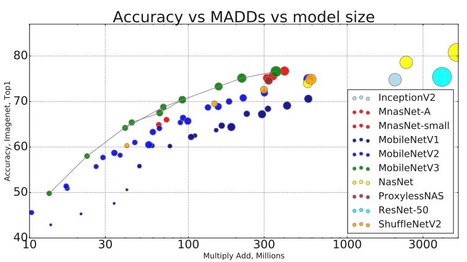

# MobileNetV3-PyTorch
A PyTorch implementation of MobileNetV3

# Overview
A PyTorch implementation of MobileNetV3 architecture: [Searching for MobileNetV3](https://arxiv.org/pdf/1905.02244.pdf). Based on MNASNet, found by architecture search, adding quantization friendly SqueezeExcite & Swish + NetAdapt + Compact layers. Result: 2x faster and more accurate than MobileNetV2.

# MobileNetV3 Architecture

# MobileNetV3 Result

